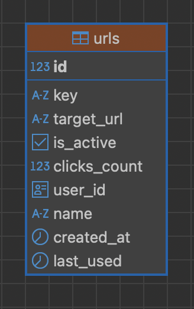

# 🚀 URL Shortener API

---

## ⚡ Features
- High-performance async REST API (FastAPI)  
- URL shortening with PostgreSQL + Redis caching  
- Event-driven via Kafka (FastStream)  
- Full DDD / Clean Architecture setup  
- Async ORM with SQLAlchemy & Alembic migrations  
- Unit of Work & transaction management  
- DI with Dishka, testing with pytest  
- Auto-generated Swagger/OpenAPI docs  

---

## 🛠 Tech Stack
| Layer               | Tools & Tech                            |
|---------------------|-----------------------------------------|
| Web Framework       | FastAPI (async)                         |
| DB & ORM            | PostgreSQL, SQLAlchemy (async), Alembic |
| Caching             | Redis                                   |
| Messaging           | Kafka (FastStream)                      |
| DI & Architecture   | Dishka, DDD, Clean Architecture         |
| Testing & QA        | pytest, Ruff                            |
| Observability       | Prometheus, Grafana, Loki, Promtail     |
| DevOps & Containers | Docker, Docker Compose, Justfile        |
---

## 📚 Documentation
| Tool          | URL |
|---------------|-----|
| Swagger UI    | [localhost:8000/api/docs](http://localhost:8000/api/docs) |
| ReDoc         | [localhost:8000/api/redoc](http://localhost:8000/api/redoc) |
| OpenAPI JSON  | [localhost:8000/api/openapi.json](http://localhost:8000/api/openapi.json) |

---

## 🏗 Architecture Diagrams


<details>
<summary>DB Schema</summary>

</details>

<details>
<summary>Classes Diagram</summary>

</details>

<details>
<summary>Packages Diagram</summary>

</details>

<details>
<summary>System Diagram</summary>
<p>TODO: Add Excalidraw system diagram</p>
</details>


---

## 🐳 Quick Start (Docker & Just)
1. Clone repo
```bash
  git clone git@github.com:mrKazzila/shortener_url_api.git
  cd shortener_url_api/backend
```

2. Configure env & pgbouncer (edit `env.env` and `backend/docker/infra/pgbouncer/userlist.txt`)


3. Start infrastructure
```bash
  just infra-up
```

4. Run app (1 1 = partitions & replicas)
```bash
  just run-app 1 1
```

5. Optional monitoring stack
```bash
  just monitoring-up
```

6.  See all available commands
```bash
  just
````

---

## 🗂 Project Tree

```shell
.
├── Dockerfile
├── Dockerfile.consumer
├── alembic.ini
├── docker
│   ├── infra
│   │   ├── docker-compose.yml
│   │   └── pgbouncer
│   │       ├── pgbouncer.ini
│   │       └── userlist.txt
│   └── monitoring
│       ├── docker-compose.yml
│       ├── grafana
│       │   ├── dashboards
│       │   │   ├── fastapi-observability.json
│       │   │   └── logs.json
│       │   └── datasources
│       │       └── datasources.yml
│       ├── loki
│       │   └── config.yml
│       ├── prometheus
│       │   └── prometheus.yml
│       └── promtail
│           └── config.yml
├── docker-compose.yaml
├── env
├── justfile
├── pyproject.toml
├── scripts
│   ├── run_app.sh
│   └── run_tests.sh
├── src
│   ├── __init__.py
│   ├── application
│   │   ├── __init__.py
│   │   ├── dtos
│   │   │   ├── __init__.py
│   │   │   ├── urls.py
│   │   │   └── users.py
│   │   ├── exceptions
│   │   │   ├── __init__.py
│   │   │   └── base.py
│   │   ├── interfaces
│   │   │   ├── __init__.py
│   │   │   ├── broker.py
│   │   │   ├── cache.py
│   │   │   ├── repository.py
│   │   │   └── uow.py
│   │   ├── mappers
│   │   │   ├── __init__.py
│   │   │   └── url_mapper.py
│   │   └── use_cases
│   │       ├── __init__.py
│   │       ├── create_short_url.py
│   │       ├── get_user_urls.py
│   │       ├── internal
│   │       │   ├── __init__.py
│   │       │   ├── add_new_url_to_cache.py
│   │       │   ├── check_key_in_cashe.py
│   │       │   ├── create_uniq_key_in_cache.py
│   │       │   ├── get_target_url_by_key.py
│   │       │   ├── process_new_url.py
│   │       │   ├── process_url_state_update.py
│   │       │   ├── publish_data_to_broker.py
│   │       │   └── publish_to_broker_for_update.py
│   │       └── redirect_to_original_url.py
│   ├── config
│   │   ├── __init__.py
│   │   ├── app_setup.py
│   │   ├── ioc
│   │   │   ├── __init__.py
│   │   │   ├── consumer_providers.py
│   │   │   ├── di.py
│   │   │   └── providers.py
│   │   └── settings
│   │       ├── __init__.py
│   │       ├── app.py
│   │       ├── base.py
│   │       ├── broker.py
│   │       ├── cors.py
│   │       ├── database.py
│   │       ├── loader.py
│   │       ├── logging.py
│   │       └── redis.py
│   ├── domain
│   │   ├── __init__.py
│   │   ├── entities
│   │   │   ├── __init__.py
│   │   │   └── url.py
│   │   ├── exceptions
│   │   │   ├── __init__.py
│   │   │   ├── base.py
│   │   │   └── domain.py
│   │   └── services
│   │       ├── __init__.py
│   │       └── key_generator.py
│   ├── infrastructures
│   │   ├── __init__.py
│   │   ├── broker
│   │   │   ├── __init__.py
│   │   │   ├── consumers
│   │   │   │   ├── __init__.py
│   │   │   │   ├── common.py
│   │   │   │   ├── consumer_new_url.py
│   │   │   │   └── consumer_update_url.py
│   │   │   └── publisher.py
│   │   ├── cache
│   │   │   ├── __init__.py
│   │   │   └── redis_client.py
│   │   ├── db
│   │   │   ├── __init__.py
│   │   │   ├── models
│   │   │   │   ├── __init__.py
│   │   │   │   ├── base.py
│   │   │   │   └── urls.py
│   │   │   ├── repository.py
│   │   │   ├── session.py
│   │   │   └── uow.py
│   │   ├── exceptions
│   │   │   ├── __init__.py
│   │   │   └── base.py
│   │   └── mappers
│   │       ├── __init__.py
│   │       └── url_db_mapper.py
│   ├── main.py
│   └── presentation
│       ├── __init__.py
│       ├── api
│       │   ├── __init__.py
│       │   ├── middleware
│       │   │   ├── __init__.py
│       │   │   └── error_middleware.py
│       │   ├── rest
│       │   │   ├── __init__.py
│       │   │   └── routers
│       │   │       ├── __init__.py
│       │   │       ├── healthcheck
│       │   │       │   ├── __init__.py
│       │   │       │   └── routers.py
│       │   │       ├── urls
│       │   │       │   ├── __init__.py
│       │   │       │   ├── _types.py
│       │   │       │   └── routers.py
│       │   │       └── users
│       │   │           ├── __init__.py
│       │   │           └── routers.py
│       │   └── schemas
│       │       ├── __init__.py
│       │       ├── healthcheck.py
│       │       ├── pagination.py
│       │       ├── urls.py
│       │       └── users.py
│       ├── exceptions
│       │   ├── __init__.py
│       │   ├── auth.py
│       │   ├── base.py
│       │   └── urls.py
│       └── mappers
│           ├── __init__.py
│           ├── url_mapper.py
│           └── user_mapper.py
├── tests
│   ├── __init__.py
│   ├── conftest.py
│   ├── e2e
│   │   └── __init__.py
│   ├── fixtures
│   │   ├── __init__.py
│   │   ├── database.py
│   │   └── environment.py
│   ├── integration
│   │   └── __init__.py
│   └── unit
│       └── __init__.py
└── uv.lock

52 directories, 123 files
```

---

## ⚠️ Over-engineering Note

<details>
<summary>Why so many technologies?</summary>
This project intentionally uses advanced technologies (Kafka, Redis, DI, DDD, async ORM) for a simple URL shortener to showcase scalable, maintainable microservice design.
</details>

---

[](https://github.com/mrKazzila) 
[](https://mrkazzila.com) 
[](https://www.linkedin.com/in/i-kazakov/)
